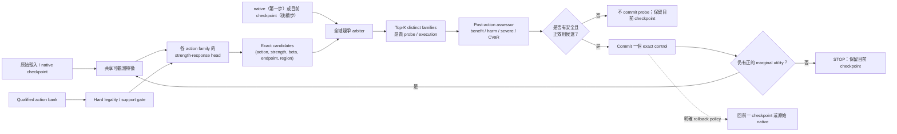

# Action bank 與 selector 架構設計

日期：2026-10-05

舊架構與 cache 的保留／搬移判斷見 [清理紀錄](CLEANUP.md)。

狀態：family-aware proposal、uncertainty evidence binding、U0 native-only training／calibration
契約、bounded flow-refinement primitive、U1 conservative loss、可續訓的 U1／U2 decoupled
trainer、GPU admission 與 opt-in multi-action orchestration 已實作；multi-action 預設關閉，
runtime uncertainty 預設只觀測、不改 flow。新的 E292 三資料集 capacity audit 顯示，若問題是 oracle 修復上限，29-arm
inventory 應先整理為 9 個 mechanism families；其中可在 KITTI、Sintel、RoCo-Spring
公平比較的 4 個 optical／matcher families 都必須保留。先前 3-family／4-control 或
R4-only 結論屬於「可觀測路由／fresh admission」問題，不能拿來回答 capacity-bank
問題。final validated bank 仍為空；新模組是研究接線，不代表 production promotion。

## 結論

RoCo 應保留 action bank，但 runtime 決策不應拆成「先選 action、再判斷是否執行、
最後才決定強度」三個彼此獨立的步驟。建議的決策單位是完整的 exact control：

```text
(action family, exact operator parameter, input strength, output beta,
 endpoint, support policy, region scope)
```

第一步的所有 exact controls 應與零成本的 `native` 一起進行全域競爭。每個 action
family 可以有自己的 strength-response head，用來提出最有希望的強度，但不能各自
決定或觸發執行；最後是否執行，必須由 selection-aware、經風險校準的全域 arbiter
決定。

進入多步流程後，`STOP` 與 `native` 不可合併：`STOP` 是保留目前已通過檢查的安全
checkpoint；`native` 是回到本次流程開始前的原始輸出。已花掉的 probe／execution
成本屬於歷史成本，無論 stop 或 rollback 都不能歸零。

簡化後的原則是：

> 每個 action 可以自行提出強度，但 action、強度與是否執行必須共同競爭。

這裡的 runtime bank 不再是 29 個平行 action。29 只保留為可追溯 inventory。若目標是
盡可能保留跨 KITTI／Sintel／RoCo-Spring 的修復上限，capacity bank 應凍結 **4 個
families 加上 native**；family head 再從 family-local anchors 中提出 1--2 個 exact
strengths。若目標改成正式 selector admission，仍須另外通過 observable routing、risk 與
fresh qualification；目前 final validated active bank 仍為空集合。

### 三資料集 family 上限：E292

E292 對 848 cases／116 個 outcome-blind scene-family groups 跑了真實 SEA-RAFT forwards：
KITTI 520、Sintel 184、RoCo-Spring 144。native／STOP 永遠可 rollback；先在各資料集內算
positive-only oracle retention，再對三個資料集等權平均。結果的 family-count Pareto 是：

| Family 數 | 最佳組合 | 三資料集等權 retention | 最差資料集 retention |
|---:|---|---:|---:|
| 1 | low-pass | 57.9724% | 49.6930% |
| 2 | low-pass + matcher compute | 83.1832% | 75.1715% |
| 3 | low-pass + joint radiometry + matcher compute | 95.7787% | 93.9720% |
| 4 | 加回 detail recovery | 100.0000% | 100.0000% |

因此在凍結的「平均至少 99.5%、每個資料集至少 98%」gate 下，不能把 family 從 4 再縮成
3。五個 grouped outer folds 都選回相同的四-family bank。這裡的四個 runtime competitors
是：

| Family | 建議 family-local proposal anchors |
|---|---|
| Low-pass HF suppression | Gaussian sigma `1.5 / 2.0` |
| Detail recovery | unsharp sigma `1.0`、amount `1.5` |
| Joint radiometry | per-channel percentile `1/99`；global percentile `5/95` |
| Matcher compute | SEA-RAFT iterations `8 / 12` |

這個 7-anchor aggressive grid 在全 848 cases 保留 99.6095% 的三資料集等權上限，最差資料集
仍有 99.2949%；但 grouped 5-fold 中，fold-selected grid 有四折選 7 anchors、一折選 8，
held-out 平均 retention 99.1208%，最差 fold／dataset 94.8445%，所以它是可直接實作的
proposal grid，不是已穩定通過每一折的最終 strength reduction。opened-capacity final list
因此採 9 anchors：在上述 7 個之外保留 Gaussian sigma `0.5 / 1.0`。固定後每折均跨過 gate，
最差 fold-balanced retention 99.5009%、最差 fold／dataset 98.5553%；移除其中任一 anchor
至少會有兩折失敗。四個 family 的 leave-one-family-out 在 5/5 held-out folds 都失敗，且
scene-family cluster bootstrap 經四重比較校正後的 capacity-loss 下界都大於零。
這個 9-anchor list 對 opened cross-component capacity 是 final，但它看過所有 opened folds，
不能冒充 unbiased CV、fresh final evidence 或 production admission。runtime 時 family head
仍只需提出最有希望的 1--2 個 strengths，不表示 9 anchors 會變成 9 個平行 action。

完整 family 組合、32,767 個 exact-control subsets、pairwise repair-space overlap 與 grouped
5-fold receipts 見 [E292](../../../experiments/E292_cross_component_action_family_frontier_v1/README.md)，
final manifest 見 [FINAL_CAPACITY_ACTION_BANK.json](../../../experiments/E292_cross_component_action_family_frontier_v1/FINAL_CAPACITY_ACTION_BANK.json)。
可攜、可由 runtime 與 trainer 直接驗證的 9-anchor manifest 則是
[`optical_flow_capacity_9anchor_v1.json`](../../../configs/stablebridge/optical_flow_capacity_9anchor_v1.json)；
它保存 E292 source-manifest SHA-256，但不攜帶 selector 或 production authority。

## 現有程式碼狀態

目前主線已有三個相關層次。

### 1. Candidate action bank

目前整合的 frozen manifest 有 29 個 inventory entries：15 個 optical／matcher actions、
9 個 weather／illumination routes，以及 5 個 learned-restoration routes。每列包含
`action_id / operator / strength / endpoint / support / cost / availability / receipt`，
並保留 native fallback。

這份 manifest 是 catalog inventory，不表示 29 個 actions 都應同時進入 active selector。
目前所有 arms 都是 TEST_ONLY，且 `production_authority=false`。詳見：

- [根目錄狀態說明](../../../README.md)
- [E243 action-bank integration](../../../experiments/E243_restoration_candidate_integration_v1/RESULT_REPORT.md)
- [Frozen 29-arm manifest](../../../experiments/E243_restoration_candidate_integration_v1/FROZEN_ACTION_BANK.json)

### 29 個 inventory entries 如何精簡

以下段落保留 E3-only 的 routing／admission 歷史；其 10-anchor、4-control 與 R4-only
shortlists 不取代上方 E292 的跨三資料集 capacity 結論。

先按「真正改變 downstream failure mode 的方向」合併，而不是按模型名稱計數：Gaussian
各 sigma 是同一 low-pass scale-space；unsharp 各 amount 是同一 detail-recovery path；
percentile 與其 bounded blend 屬同一 paired-radiometry family；matcher iterations 是同一
compute path。同一 restoration task 的不同 learned models 則先視為 family 內 competitor，
不能各佔一個 active-family slot。

在 1,200-row、30-scene 的 opened E3 panel 上，再以 native-positive-only oracle capacity
做聯合子集搜尋。凍結 gate 為整體保留至少 99.5%、每個 corruption 至少 98%，且四個
理論上不同的 families 都必須保留。結果如下：

| Candidate family | 保留的 exact-control anchors | 為何不再合併 |
|---|---|---|
| Low-pass HF suppression | Gaussian sigma `1.0 / 1.5 / 2.0` | 對 noise／JPEG 的最佳尺度不同 |
| Detail recovery | Unsharp amount `0.5 / 1.5` | 與 low-pass 的頻譜方向相反；弱／強 response 不同 |
| Joint radiometry | blend `0.5`、joint percentile `1/99`、per-channel `1/99`、joint `5/95` | scalar、channel-wise 與 clipping range 不是同一 response ray |
| Matcher compute | SEA-RAFT iterations `12` | 不修改影像，修復空間與前三者不同 |

因此第一階段 capacity shortlist 是 **4 families／10 exact controls**，不是 29 個平行 actions。相對完整
15-arm optical oracle，它保留 99.5232% 的 positive repair capacity；四個 corruption 的
最低保留率為 98.4331%。固定這 10 個 controls 後做 2,000 次 scene-cluster bootstrap，
整體保留率的 95% interval 為 99.0795%–99.7707%。這仍是 opened-development reduction
evidence，不是 selector 或 production qualification。對 shortlist 做 leave-one-anchor-out
時，十個 anchors 中任何一個被拿掉都會使至少一個 frozen retention gate 失敗。

但 oracle capacity 不等於 selector 能從可觀測特徵中可靠地使用該 control。E275--E278
以 nested scene-group OOF router 逐輪重訓並做 action-route contribution screen：E275 刪除
Gaussian sigma 1.5、per-channel 1/99 與 iterations 12；E276 刪除 joint 5/95；E277 刪除
unsharp 0.5 與 radiometric blend 0.5。得到下一輪應凍結的候選：

| Candidate family | Fresh validation 的 exact controls |
|---|---|
| Low-pass HF suppression | Gaussian sigma `1.0 / 2.0` |
| Detail recovery | Unsharp amount `1.5` |
| Joint radiometry | Joint percentile `1/99` |

E278 對這 4 個 controls 的 OOF 診斷為 corrupt macro gain `5.3547%`、clean degradation
`0.5023%`、4/4 corruptions point-improved、catastrophe/intervention `0.3289%`；corrupt gain
的 scene-bootstrap 95% interval 是 `1.6583%–9.1815%`。四個 routed-contribution interval
下界都大於零。

E279 再把 overlap 檢查改成真正的 policy-level ablation：每次拿掉一個 action，完整重訓
router 與 inner calibration，再和 full bank 做 paired outer-OOF 比較。四個 action 的
oracle-capacity simultaneous lower bounds 都大於零，表示它們都能提高理論修復上限；但
在 selection-aware routed value 上，只有 unsharp amount 1.5 的四重比較校正下界大於
零。Gaussian sigma 1/2 的點估計為正但 interval 跨零；拿掉 joint 1/99 甚至讓 corrupt
macro gain 從 `5.3547%` 升至 `6.0785%`，但 brightness 由改善變成輕微退步。這把問題
明確拆成「mechanism 有 capacity」與「selector 能可靠利用 capacity」兩個 gate。

E281 再補上 family-level LOO：同時移除 Gaussian sigma 1/2 並完整重訓後，full bank 的
corrupt macro 優勢為 `0.022499 px`，三-family 多重比較校正後下界仍為 `+0.000348 px`。
因此兩個 Gaussian anchors 各自可部分替代、單獨 LOO 不顯著，不等於 low-pass family
可以刪除；low-pass family 本身有 opened-development 支持。
Unsharp family 同樣通過；joint radiometry 只有 oracle/brightness 的獨特上限，尚未證明
routed necessity。Fresh protocol 因而必須同時做 action-level 與 family-level LOO。

但 family 必要性不能直接當成 strength proposal 成功。E282 將 low-pass 單獨拿出來，分別
重訓 `{sigma1,sigma2}`、`{sigma1}` 與 `{sigma2}` router。雙 strength oracle gain 是
`9.2731%`，兩個 anchors 都有顯著的獨特 oracle capacity；然而雙 strength learned router
在 6/6 outer folds 都校準成 native、routed gain 為零，反而 sigma2-only 有 `2.2268%` gain。
因此目前只能保留兩個 anchors 作 fresh capacity hypothesis，**不能宣稱 selector 已會提出
可靠 strength**，更不能開 continuous interpolation。Fresh admission 必須要求 multi-strength
policy 對每個 independently retrained single-strength policy 都有 simultaneous-positive 優勢。

這仍不能稱為 final validation：29→10 與 E275→E278 都查看過相同 E3 outcomes，反覆以
outer-OOF 結果刪 action，使 outer folds 成為開發資料；而 routed-contribution 也沒有
和「移除該 action 後重新訓練、讓其他 action 代替」的 policy 做配對比較。因此這 4 個
是 **frozen opened-development candidates**，final validated bank 仍是空集合。合理的下一
步是全新 component/scene-group panel 上的 nested Group K-fold，以及 selection-aware
leave-one-action-out retraining；詳見 [validation protocol](../../../research/action_bank_29_finalization_20261005/VALIDATION_PROTOCOL.md)。

這裡的「K-fold」不能解讀成隨機切 1,200 rows。每個 physical scene 的 clean、所有
corruptions、frames 與 repeats 必須綁在同一 group；outer fold 只做 held-out OOF 評估，
normalization、模型、threshold 與 calibration 全部只能在 inner grouped folds 決定。
預設可用 outer 5-fold／inner 4-fold，但 K 並不增加獨立樣本數；若目標是跨 dataset／capture
system，則應 hold out 整個 component。full bank 與四個 leave-one-action-out banks 也必須
各自完整重訓，並在相同 outer rows 做 paired、scene-clustered、multiplicity-corrected 比較。
E280 已證明可變 K trainer 在既有 6-fold E278 上逐筆、逐輸出與模型 hash 完全重現；這只
驗證實作，並未讓已開啟的 E3 重新變成 fresh evidence。詳見
[E280 parity report](../../../experiments/E280_dynamic_group_router_parity_v1/README.md)。
E287 再做 outcome-label falsification：只改寫 outer fold 0 的 120 筆 teacher losses 後完整
重跑，該 fold 的 normalization／threshold／calibration、model hash、model outputs 與 selected
actions 仍 exact equal，而 120 筆 evaluation values 與其餘五個合法 training folds 的模型均
改變。這直接驗證 outer targets 不會流入自身決策；同樣只屬 implementation evidence。
完整 fresh 執行已凍結成 9 個 unique router runs（full、action/family LOO、multi/single
strength controls）；詳見 [fresh-validation work package](../../../research/action_bank_29_finalization_20261005/FRESH_VALIDATION_WORK_PACKAGE.json)。目前缺少 untouched powered panel、
before-only features 與 exact action outcomes，因此 package 是可執行規格，不是通過證據。
這 9-run matrix 現在只保留作完整機制診斷；嚴格的 primary admission shortlist 已再縮為
**R4 unsharp amount 1.5 單一 action**，因為只有它的 selection-aware action-LOO simultaneous
lower bound 大於零。P1/R2 降為 low-pass shadow hypotheses，P3 降為 radiometry shadow；三者
都不參加 primary fresh admission，也不會因 oracle headroom 自動進 final bank。
GPU 已不是 blocker：E283 已在 sandbox 外的 RTX 3090 對一筆已開放 E3 row 跑完 native 與
四個 exact controls，所有輸出均通過 shape／float32／finite 檢查；但這只是 execution
preflight，不是 fresh statistical evidence，也不會讓任何 action 進 final bank。
此外 E284 已把完成 acquisition、尚未解碼 outcome 的 TartanAir official-flow panel 凍結：
20 environments、160 physical pairs、clean 加 20 種 corruption 的三種 endpoint exposure，
共 9,760 rows，並以 environment 做 outer 5-fold。它與過去已解碼的 8 個 official members
零重疊；但 20 個 independent groups 低於預註冊最低 65，因此只能作 reject-only 外部證據，
不能單獨以 positive result admission action，也不能因為做更多 folds 或 repeated CV 就視為
樣本數增加。另以 metadata-only audit 檢查仍封存的 KITTI H2：70 scenes 只跨過最小的
65-group 門檻，未跨過 Gaussian sigma 1/2 的 136/607 規劃數，且目前
`h2_execution_authorized=false`。既有 E186 H2 contract 也只有 5 種 corruption，未滿足
本 action-bank 的 20-corruption coverage。E288 已補上 action-bank-specific 的 metadata-only
final protocol：只測 R4、70 scenes、20 corruptions、outer 5-fold／inner 4-fold、共 4,270 rows，
因此 method design 已符合 R4 的 65-group planning count 與 normative coverage；E289 再從
既有 JSON metadata 封存全部 4,270 個 exact rows 與五折 scene assignment，仍未開啟任何
H2 payload；E290 再凍結每 row 四次 forward／60 維 before-only feature 的 GPU runner，三個
authorization-bypass tests 全部 fail closed 且 H2 access 維持零。不過 E286
必須先存活、既有 H2 governance 必須授權（或核准 versioned exception），且仍需明確使用者
授權；目前不得讀取其 image、GT 或執行 forward。
E285 已把 E284 的 R4-only pre-outcome 階段全部完成：9,760 rows 各有 native/R4 prediction
content hash 與 60 維 before-only features，且獨立重跑同列可逐項 exact reproduce；receipt
中沒有 official-flow path。這只解除 inference／feature readiness blocker，仍未授權解碼
outcome，也不能讓 R4 進 final bank。
E286 也已事前凍結 official-flow decoder、elastic GT transport、prediction hash replay 與
5×4 nested grouped reject-only 決策。缺少另行授權檔時，scorer 會在模型初始化和任何 output
建立前 fail closed；因此目前 flow payload decode 仍為零。

被刪除的 5 個 optical anchors 是 Gaussian sigma `0.5`、unsharp amount `1.0`、radiometric
blend `0.25 / 0.75` 與 matcher iterations `8`；它們在聯合搜尋中可由保留 anchors 覆蓋。
其餘 14 個 learned／weather entries 被合併為 10 個 mechanism groups 並留在 shadow bank：
motion、defog、derain、desnow 的同 task models 各自先做 head-to-head；INIKNet、DPIR、
SwinIR、Retinexformer、defrost 與 despatter 在 full-action 或 fresh task-aligned gates 尚未
完成前，不進 shortlist，更不能進 final active bank。

完整、可重算的 partition 與結果位於：

- [29-arm reduction report](../../../research/action_bank_29_finalization_20261005/README.md)
- [Reduced candidate bank](../../../research/action_bank_29_finalization_20261005/REDUCED_CANDIDATE_BANK.json)
- [Frozen four-control candidate](../../../research/action_bank_29_finalization_20261005/OPENED_CANDIDATE_ACTION_BANK.json)
- [Empty final validated bank](../../../research/action_bank_29_finalization_20261005/FINAL_VALIDATED_ACTION_BANK.json)
- [E279 selection-aware LOO](../../../experiments/E279_selection_aware_loo_v1/README.md)
- [E280 dynamic grouped-router parity](../../../experiments/E280_dynamic_group_router_parity_v1/README.md)
- [E287 outer-label leakage falsification](../../../experiments/E287_dynamic_router_outer_leakage_test_v1/README.md)
- [E281 family-level LOO](../../../experiments/E281_selection_aware_family_loo_lowpass_v1/README.md)
- [E282 low-pass strength proposal](../../../experiments/E282a_lowpass_two_strength_router_v1/README.md)
- [E288 powered H2 R4 final protocol](../../../experiments/E288_h2_r4_final_protocol_freeze_v1/README.md)
- [E289 exact H2 R4 panel freeze](../../../experiments/E289_h2_r4_panel_freeze_v1/README.md)
- [E290 authorized H2 target-free runner](../../../experiments/E290_h2_r4_preoutcome_runner_v1/README.md)
- [Exhaustive 29-action admission matrix](../../../research/action_bank_29_finalization_20261005/ACTION_ADMISSION_MATRIX.json)
- [Optical reduction result](../../../research/action_bank_29_finalization_20261005/OPTICAL_REDUCTION_RESULT.json)
- [Reduction analysis](../../../research/action_bank_29_finalization_20261005/analyze_optical_reduction.py)
- [E248 mechanism-overlap audit](../../../experiments/E248_action_mechanism_overlap_v1/RESULT_REPORT.md)

### 2. Action descriptor 與 exact control

舊的八欄 catalog 中，`strength` 的語意不一致：optical action 可能是 float，
weather／learned route 則可能是 policy mapping。v2 contract 已經正確將以下概念分開：

- operator 的物理參數，例如 sigma、iteration、JPEG quality；
- selector 使用的 normalized `input_strength`；
- candidate output 的 `output_beta`。

Adapter 不會把 operator parameter 猜測成 selector strength，也不會替缺失的 control
語意填入假造的零或一。詳見：

- [`action_bank_contracts.py`](../../../src/stablebridge/physical_repair/action_bank_contracts.py)
- [`action_bank_adapter.py`](../../../src/stablebridge/physical_repair/action_bank_adapter.py)

### 3. Selector-v7

Selector-v7 已接近本文建議的主要結構：

1. manifest 中每個 `CandidateArmV7` 都綁定 exact `input_strength` 與 `output_beta`；
2. native 是強制存在的 action 0；
3. before-only planner 從 hard-legal arms 中提出 K1 或 K2 candidates；
4. post-action assessor 分別估計 benefit、mean harm、any-row severe risk、harmed
   fraction 與 CVaR；
5. committer 只從通過所有 gate 的 safe set 中選 conservative utility 最大者；
6. malformed binding、missing evidence、cost overflow 或無正效用時 fail closed 至
   native。

詳見 [`selector_v7.py`](../../../src/stablebridge/physical_repair/selector_v7.py)。

因此主線不需要改成一套完全不同的 selector；需要補強的是 action-family-aware 的
strength proposal、active bank 管理，以及完整 action-strength family 的共同校準。

Family-aware exact-control proposal 已實作於
[`family_action_competition.py`](../../../src/stablebridge/physical_repair/family_action_competition.py)。
它不修改既有 Selector-v7 schema，而是在上層強制：

- 每個 non-native exact arm 都有完整 family／strength／variant／beta binding；
- 每個 hard-legal arm 都必須有一筆 before-only score；
- 對完整 `action + strength + beta` 候選做聯合、受預算約束的 K1/K2 搜尋，而不是先
  固定 action 才找 strength；
- K2 最多取每個 family 一個 exact control，且以整個 portfolio 的效益減成本作比較；
- 原始 Selector-v7 `candidate_family_hash` 仍覆蓋全部 exact controls，避免選完後縮小
  calibration family；commit wrapper 更要求 calibration 覆蓋完整 hard-legal choice
  family，而不只覆蓋被提出的 winners；
- proposal、完整 score family、family registry、suppression trace 與 inner v7 proposal
  都有封存 hash，mutable-input 或 binding drift 會 fail closed。

對應測試位於
[`test_family_action_competition.py`](../../../tests/stablebridge/test_family_action_competition.py)
與
[`test_family_action_competition_adversarial.py`](../../../tests/stablebridge/test_family_action_competition_adversarial.py)。

程式使用明確 submodule import；不重新輸出到 `physical_repair.__init__`，因該檔案屬於
既有 frozen source closure：

```python
from stablebridge.physical_repair.family_action_competition import (
    ActionFamilyManifestV1,
    FrozenActionFamilyDefinitionV1,
    propose_family_competition_v1,
    select_family_portfolio_v1,
)
```

`propose_family_competition_v1` 必須收到完整 hard-legal score family、K1/K2 budget 與
明確 cost penalty；`select_family_portfolio_v1` 才是 commit 入口，不能繞過它直接用只
覆蓋 winners 的 calibration 呼叫底層 v7 committer。

### 4. Uncertainty-aware flow 與 family competition（本輪已接線）

Uncertainty 不應只被當成另一個 restoration action。它有三種不同角色，必須在設定與
checkpoint identity 上分開：

1. **Observer-only**：不更動 flow，只提供「哪裡不可靠」的 before-only 特徵、probe
   priority 與 post-action uncertainty delta；這是目前安全預設。
2. **Bounded refinement**：以 uncertainty reliability 調節一個有 pointwise norm cap 的
   flow residual。這會改動 flow，必須視為新的 matcher candidate，重建 outcomes、bank
   與 calibration。
3. **Bidirectional fusion**：仿 U²Flow 使用 uncertainty 融合方向資訊；需要額外 frame、
   cost 與 occlusion contract，因此另列研究模式，不與 observer-only 混用。

Provider-neutral contract 與 bounded refiner 已實作於
[`uncertainty_aware_flow.py`](../../../src/stablebridge/physical_repair/uncertainty_aware_flow.py)：

- `UncertaintyReceiptV1` 封存 provider/checkpoint/input/flow/map、語意、iteration、有效性、
  空間 embedding 與 summary；missing/OOD 是有型別的狀態，不能偷填零；
- `UncertaintyRuntimePolicyV1` 預設為 `observer_only`，未明確啟用且給定正的 pixel update
  bound 時，禁止修改 flow；
- `DecoupledUncertaintyHeadV1` 與目前 Work B 的 12-channel feature bank 相容；
- `BoundedUncertaintyFlowRefinerV1` 將 uncertainty detach 後才轉成 reliability，輸出的
  residual 有明確最大 pixel norm；
- `augmentation_consistency_laplace_loss_v1` 將 augmentation discrepancy 的兩條 flow
  路徑都 detach，避免 uncertainty loss 偷改 teacher flow。

Uncertainty 進入 action competition 的證據綁定已實作於
[`uncertainty_family_competition.py`](../../../src/stablebridge/physical_repair/uncertainty_family_competition.py)。它不改 frozen
Selector-v7 schema，而是在外層證明：

- before-only planner 實際吃到哪一份 native uncertainty receipt／spatial feature；
- post-action risk assessor 實際吃到哪一組 native-versus-executed-child uncertainty delta；
- 缺 uncertainty 時 score 必須標記 incomplete，不能冒充完整觀測；
- uncertainty receipt 只是一項 feature evidence，不能單獨證明 action benefit 或 safety。

這個區分很重要。現有 Work B 的 augmentation self-consistency scale 可以當作 observation，
但它不是 GT flow error、不是 action-specific benefit，也不是經 selection-aware calibration
的 harm probability。最終 commit 仍必須依真實 action outcomes 所學的 downstream
gain/harm/severe/CVaR gates。

### 5. Multi-action 外層狀態機（已接線、預設關閉）

[`multi_action_orchestrator.py`](../../../src/stablebridge/physical_repair/multi_action_orchestrator.py)
把既有 `select_family_portfolio_v1` 當成不可變的單步決策 primitive。預設 policy
`enabled=False, maximum_steps=1, maximum_commits=1`，此時直接 tail-call 原 selector 並
回傳同一物件，不建立新的 state、receipt 或 hash；因此目前仍只執行一次 action。

接好的研究路徑有兩種：

- `ROOT_RETRY`：第一個 probe 不 commit 時，依 observation 前已凍結的 schedule 從原始
  root 試下一個候選；失敗 execution 與 rollback 的成本仍永久記帳。
- `COMPOSED_CHAIN`：commit 後，下一步 manifest 必須重新綁目前 safe checkpoint；第二步
  起還要有 action-order transition receipt，以及相對 original native 重算的 cumulative
  risk receipt。

目前只授權 schema 與 fail-closed wiring，不啟用多步 production policy。`STOP_CURRENT`
保留現在的 safe checkpoint；回原始 native 是另一個 rollback 操作。兩個單步各自安全
也不表示組合安全，沒有 sequence-level calibration 與 cumulative-risk receipt 時，chain
會被拒絕。

對應測試位於
[`test_uncertainty_aware_flow.py`](../../../tests/stablebridge/test_uncertainty_aware_flow.py)
與
[`test_multi_action_orchestrator.py`](../../../tests/stablebridge/test_multi_action_orchestrator.py)。

## Uncertainty 要怎麼訓練

### Stage U0：凍結 matcher，只訓練 uncertainty observer

對同一 image pair 建立 native view 與可精確逆映射的 photometric／geometric augmentation
view。以凍結 matcher 分別得到 `F_native` 與逆映射回原座標的 `F_aug`，只在共同有效、
非 padding／非越界 support 上計算：

```text
D(x) = || stopgrad(F_native(x)) - stopgrad(T^-1(F_aug)(x)) ||_2
L_U  = mean[ D(x) * exp(-u(x)) + u(x) ]
```

其中 `u` 是 predicted log Laplace scale。`D` 是 noisy proxy，不是真實 error；訓練集、
early-stop set、calibration set 與 final test 必須以 scene/component 分組切開。除了 NLL，
應在獨立 calibration fold 報告 error ranking、coverage-risk curve、ECE／NLL，以及 high-U
區域對 severe harm 的 recall；不能只報 uncertainty map 看起來合理。

U0 可以直接沿用現有 12-channel Work B head 作初始 observer，但要重新封存 feature schema、
augmentation recipe、provider checkpoint 與 normalizer。若有 sparse/complete GT，可另加
supervised error target 作對照；不可把 GT 或 corruption label 放進 runtime features。

### Stage U1：凍結 matcher 與 U，只訓練 bounded flow refiner

將 `r(x)=sigmoid(-log_variance(x))` 當作 detached reliability，refiner 根據 matcher feature、
base flow 與 `r` 提出 residual `delta F`，並限制每點 `||delta F|| <= delta_max`。訓練目標
不能只靠 uncertainty NLL，而應包含 task-aligned flow loss（有 GT 時）、photometric/census
consistency、occlusion-aware smoothness，以及 anchor-to-base regularization。所有比較都要
同時報 base matcher，避免把 observer 的校準改善誤當成 flow 改善。

現有 frozen WAFT adapter 不公開可訓練 recurrent hidden state，因此第一版應把 refiner 視為
post-hoc bounded module；若要插入 recurrent update，就建立新的 matcher backend，而不是
解除現有 frozen adapter 的 `inference_mode`。任何 U1 checkpoint 都是新的 flow provider，
不得沿用舊 action outcomes 或 calibration receipts。

### Stage U2：切斷交叉梯度的交替微調

只有 U0、U1 都在獨立 component 上通過後才做：

1. 固定 matcher/refiner，以 detached consistency target 更新 U；
2. 固定 U，以 detached reliability 更新 matcher/refiner；
3. 不允許 uncertainty loss 經 teacher discrepancy 回傳到 flow，也不允許 flow loss 藉
   reliability 改寫 U 來逃避困難像素；
4. 每個 alternating round 都保存獨立 checkpoint identity，重新做 calibration 與
   action-bank outcome generation。

這是從 U²Flow「uncertainty 確實可以參與 refinement，但 decoupling 很重要」得到的保守
改寫。最佳版先包含 U2 的訓練能力，但 runtime promotion 必須逐 stage 通過；不能因為
研究設定是 full model，就跳過 U0/U1 的可否證檢查。

## RestoreAgent 的架構啟示

[RestoreAgent](https://arxiv.org/html/2407.18035) 的核心不是讓多個 restoration
actions 各自決定是否執行，而是在整個 model tool library 上共同決定：

1. 哪些 restoration tasks 需要執行；
2. tasks 的執行順序；
3. 每個 task 使用哪一個 model；
4. 執行後是否重新規劃、rollback 或 stop。

論文以各種 task order 與 model combination 的實際結果建立 optimal-pipeline
supervision，再 fine-tune MLLM 產生 pipeline。它也支援 step-wise replanning：每執行
一步就重新觀察影像，帶入 execution history，必要時 rollback。不過論文的主要實驗
仍以 initial one-shot planning 為主，step-wise planning 是額外 refinement。

論文沒有實作一般性的連續 action strength controller。其強度主要由離散 model
variants 表達，例如：

- low／medium／high noise level 的三個 denoising models；
- mild／severe JPEG artifact 的兩個 deJPEG models。

因此 RestoreAgent 支持的抽象是「action family + intensity/model variant 共同形成
候選，再做全域 sequence selection」，而不是「先選 denoise，再輸出任意連續強度」。

RoCo 不應直接複製其 MLLM 作為最終 selector。RoCo 的 endpoint 是 stereo／flow
task error，且需要 severe harm、CVaR、component-disjoint calibration、native
rollback 等保護；現有 conservative selector contract 更適合作為最終 committer。

## Related work 與研究定位

以下工作分別覆蓋了參數化 action、image-restoration agent、deferral learning 與策略層
risk calibration。它們支持本架構的組件選擇，也表示目前不應宣稱「工具選擇加強度控制」
本身就是首次提出。

| Work | 與本設計的關係 | 不能直接取代的部分 |
|---|---|---|
| [P-DQN](https://arxiv.org/abs/1810.06394) (2018) | 對每個離散 action 產生自己的連續參數，再比較 action-parameter pair；最接近 family proposer → global competition | 是 RL value learning，沒有 RoCo 的 downstream severe-harm／CVaR contract |
| [MP-DQN](https://arxiv.org/abs/1905.04388) (2019) | 評估 action A 時屏蔽其他 action 的參數，修正 P-DQN 的跨 action-parameter 污染 | 仍是 parameterised-action RL，沒有獨立校準與 probe 後 commit gate |
| [U²Flow](https://arxiv.org/abs/2604.10056) (CVPR 2026) | augmentation-consistency uncertainty 可作 flow 的空間化 pre-action observable，幫助定位不可靠區域與安排 probe | uncertainty 回答「哪裡可能不可靠」，不直接回答哪個 intervention 有益；其 bidirectional fusion 另需三幀 |
| [RestoreAgent](https://arxiv.org/abs/2407.18035) (2024) | 全域選 restoration task、順序與 model variant，並支援重新規劃 | 主要目標是影像恢復品質，不是 flow／stereo downstream risk |
| [Q-Agent](https://arxiv.org/html/2504.07148v1) (2025) | 每一步實際執行所有可用 restoration operations，以五種 no-reference IQA 比較結果；沒有改善即停止 | 是昂貴的 exhaustive-execution／IQA baseline，不是有限 probe 下的 downstream gain/harm prediction |
| [RL-Restore](https://arxiv.org/abs/1804.03312) (CVPR 2018) | 將 STOP 作為工具之外的第 `N+1` 個 action；STOP 是 identity mapping，直接回傳目前影像 | 以 PSNR step reward 學離散 toolchain，沒有 selection-aware risk calibration |
| [Derain-Agent](https://arxiv.org/abs/2603.11866) (2026) | 規劃工具序列並以 spatial strength modulation 控制工具殘差，接近 `output_beta`／beta map | 是先定路徑再調 delivery strength，不等同多個 action-strength exact controls 共同競爭 |
| [SkillIR](https://arxiv.org/abs/2609.21468) (2026) | 每次只做一個 bounded action；候選通過 transition verification 才 commit，之後重估 residual state | 沒有同一步多個 action-strength 候選的共同 downstream 校準 |
| [Regression with Multi-Expert Deferral](https://proceedings.mlr.press/v235/mao24d.html) (ICML 2024) | 可把 native 與 exact controls 視為帶 instance-dependent cost 的 experts，學習回歸式 routing，而不是猜 oracle action ID | bounded-loss consistency 不等於 per-case severe-harm 或 CVaR 保證 |
| [Learn then Test](https://arxiv.org/abs/2110.01052) | proposer／selector／verifier 全部凍結後，以獨立 calibration data 做多重風險檢定 | 是策略層有限樣本風險控制，不保證每張影像安全，也不能把同場景相關 pixels 當獨立樣本 |

由 MP-DQN 得到的直接建模限制是：可以共享 observation encoder，但
`score(denoise, 0.3)` 的輸入不得包含 sharpening family 當次提出的 strength；候選間的
相對比較只發生在 global arbiter。這可避免「另一 action 的參數改變，卻改掉本候選自身
效益估計」的錯誤耦合。真正允許跨 action 互動的地方，應是有明確 execution history 與
interaction receipt 的 sequential planner。

因此目前可防守的研究主張不是發明 parameterised action 或 restoration agent，而是：

> 在固定、有限的 probe budget 下，讓 action 與 strength 共同競爭，並以 downstream
> correspondence gain、harm 與 selection-aware calibration 決定 commit／abstain。

這仍是待實驗驗證的定位，不是已成立的新穎性結論。

從架構來源看，可將主線拆成三個已各有文獻依據、但尚需在 RoCo 中共同驗證的部分：

1. P-DQN／MP-DQN：每個 action 提出自己的參數，並避免其他 action 的參數污染本候選；
2. Q-Agent：執行候選後比較，但本研究要用少量 K1/K2 probes 取代全部執行；
3. RL-Restore：STOP 是保留目前狀態的明確 action，而不是回到 original native。

RoCo 的差異化問題是如何把三者改成 correspondence-task 的收益／傷害尺度、有限成本的
proposal、post-action verification 與完整 choice-family calibration。

## 推薦的整體架構



### Layer A：Action registry 與 qualification

完整 catalog 保存所有已知 action templates，但 runtime 只載入通過必要 qualification
的 active bank。每個 template 至少需要：

```text
action_family_id
operator_id / operator_version
physical_parameter_domain
strength_domain
beta_domain
endpoint policy
support policy
cost and availability
rollback contract
evidence and calibration lineage
```

完整 catalog、active bank 與 shadow／research bank 必須分離：

- **catalog**：保存 29-arm inventory 與未來 action；
- **active bank**：可進入正式 selector competition 的小型 qualified set；
- **shadow bank**：只做離線 capacity、observability 與 qualification 研究。

### Layer B：共享 observation encoder

所有 action 共用同一份 runtime 可觀測特徵，避免每個 action 重複建立互不一致的場景
分類器。輸入可以包含 before-image observables、native flow／stereo observables、
cheap physical evidence、support geometry 與成本資訊，但不能使用 corruption name、
severity label、GT 或 outcome。

共享 encoder 產生狀態表示 `z(x)`，再交給 family-specific heads。這能讓不同 actions
共享統計強度，同時保留各自不同的 response law。

既有 U²Flow-style uncertainty 應保留在 Selector-v7 已凍結的
`native_flow_observable` bundle 中，作為空間化 pre-action evidence。至少保存
uncertainty map／spatial embedding、tail quantiles、high-uncertainty support fraction、
來源 model/input hash 與 availability；不可只壓成一個無 provenance 的 scalar。若 active
policy 宣告需要這份特徵，缺失時必須是 `TYPED_MISSING`／OOD，而不能偷偷補零。

它可以影響：每個 exact control 的 gain prediction、family proposal 排序、probe scheduling
與 abstention。它**不能單獨**通過 hard legality、直接 authorize action／output pixel，或
取代 post-action benefit/harm/severe/CVaR assessor。對 stereo 需使用相同角色的 task-native
uncertainty receipt；不得把 flow-only U²Flow 訊號偽裝成跨 task 已驗證特徵。若使用
U²Flow 的三幀 fusion，必須另列 three-frame protocol 與成本，不能混入 pair-only baseline。

已完成的 E275 opened-development diagnostic 也支持這個限制。在相同 1,200 rows／30 scenes
上，14 個 target-free native-U scalars 對 10 個 exact controls 的關係不是同方向：例如
`B0_mixture_entropy_p50` 對 Gaussian sigma 2 的 U/gain Spearman 為 `+0.3619`
（scene-bootstrap 95% interval `+0.2051` 到 `+0.5062`），但
`B0_endpoint_rms_p90` 對 joint-channel-percentile 的 U/gain Spearman 為 `-0.2602`
（`-0.3850` 到 `-0.1243`）。因此「U 高就做某 action」或一個跨 action 的 U threshold
在數學上會混合不同 response laws；U 應進 action-conditioned heads，並與 RGB／flow
observables 一起比較。完整 2,000-draw 報告見
[`E275_UNCERTAINTY_ACTION_DIAGNOSTIC.json`](../../../research/action_bank_29_finalization_20261005/E275_UNCERTAINTY_ACTION_DIAGNOSTIC.json)。
這仍是反覆使用過的 scalar E3 outcome，只能作架構診斷；沒有 pixel harm target、未做
multiplicity adjustment，也不提供 calibration、safety 或 final-bank authority。

### Layer C：Per-action strength-response heads

對每個 action family `a`，proposal head 在凍結的候選集合 `S_a × B_a` 上先估計：

```text
planner_predicted_gain_raw_px(a, s, beta)
predicted_support / availability(a, s, beta)
prospective_cost(a, s, beta)
```

family head 的責任是提出該 action 最有希望的 1–2 個 strength/beta combinations，
不是自行決定執行。每個提案仍必須保留完整 exact-control identity。

這些 pre-action outputs 在尚未完成獨立 calibration 前只能稱為 `predicted_*`，不能因欄位
命名就宣稱是可靠的 lower／upper bound。候選實際 materialize／probe 後，post-action
assessor 才在凍結 calibration receipt 下輸出：

```text
benefit_lower
mean_harm_upper
severe_probability_upper
harmed_fraction_upper
CVaR_upper
```

因此 proposal 階段負責「值得花成本試誰」，commit 階段才回答「觀測後是否安全採用」。

### Layer D：Global competition 與 native abstention

全域 arbiter 將所有 exact candidates 與 native 一起比較。先定義：

```text
Safe(x) = {
    (a, s, beta):
        hard_legal
        and all required evidence is available
        and benefit_lower > 0
        and mean_harm_upper <= tau_mean
        and severe_probability_upper <= tau_severe
        and harmed_fraction_upper <= tau_fraction
        and CVaR_upper <= tau_cvar
}
```

對 safe candidates 使用 conservative objective：

```text
J_lower(a, s, beta)
    = net_gain_lower(a, s, beta)
    - lambda_cost * cost(a, s, beta)
    - interaction_upper(a, s, beta)
```

只要被選候選滿足以下條件即可 commit：

1. `J_lower > 0`，確實優於 native；
2. 通過所有獨立 risk gates；
3. selection-aware calibration 覆蓋完整的 action-strength choice family。

這裡刻意不要求 winner 的下界高於所有 rival 的上界。若 A、B 都能安全改善，只是無法
統計上證明誰是唯一最佳，仍可依 frozen 的 conservative utility、成本與 deterministic
tie-break 選一個；「安全改善」與「證明全場最佳」是兩個不同命題。若沒有任何正效用
safe candidate，才選額外 probe／audit 或保留目前 checkpoint。Selector-v7 的
`SAFE_SET_MAXIMUM` 已是這種語意；舊 `action_plan.py` 的 rival-separation 規則不應套到
這條新主線。

### Layer E：Probe、commit 與 sequential replanning

若 action 執行成本允許，before-only planner 可先提出 Top-K candidates，執行後再由
post-action assessor 重新排序。但 Top-K 應優先來自不同 action families，避免同一
family 的多個相近 strengths 占滿 K2，排除其他可能機制。

每一步最多 commit 一個 exact control。Commit 後才能以新的 checkpoint、execution
history 與 remaining budget 重新規劃下一步。下一步比較的是「繼續執行某 exact
control」與「STOP 並保留目前 checkpoint」，同時仍要檢查相對原始 native 的累積風險。
任何惡化、證據缺失或風險超標，都不得 commit 該 probe；只有明確 rollback policy 才能
回上一 checkpoint 或原始 native。已消耗成本永久記在 execution history。

在 interaction receipts 尚未完整前，不應讓多個 action 獨立並行觸發或直接組合。

## Strength 的語意與建模方式

以下四種量不可混用：

| 欄位 | 意義 | 範例 |
|---|---|---|
| `operator_parameter` | action 真正的物理／模型參數 | sigma=1.5、iterations=12、JPEG Q=10 |
| `input_strength` | family 內標準化的輸入控制量 | blur family 中的 normalized magnitude |
| `output_beta` | candidate output 的交付／融合強度 | native 與 candidate 的 bounded blend |
| `support` | action 實際作用的空間範圍 | whole case、certified local region |

Normalized strength 只能在同一個 family 內解讀。不同 action 都使用 `0.5` 不表示它們
具有相同物理強度，也不應讓 selector 直接以數值大小跨 family 比較。跨 family 的共同
比較尺度必須是 downstream benefit、harm、risk 與 cost。

對 learned restoration model，strength 也可能是 categorical model variant，而非連續
數值。此時應明確保存 `variant_id`，不應將其偽裝成可插值 scalar。

## 為什麼目前不宜直接使用完全連續 strength

現有 K1 study 顯示，action bank 本身有容量，但 learned routing 尚未成功：

- executable K1 oracle mean gain 為 `+0.4274805475 px`，且 severe rows 為零；
- learned diagnostic policy mean gain 為 `-0.6062173779 px`，並有 1,333 severe rows。

這將瓶頸定位在 observability、learning 與 routing，而不是缺少 actions。詳見
[K1 competition 結果](../../../research/selector_k1_competition_v2_20261004/README.md)。

另一方面，已開啟資料上的 exact subset frontier 顯示：

| Nonnative action types | 保留的 raw union capacity |
|---:|---:|
| 1 | 64.61% |
| 2 | 83.31% |
| 3 | 98.82% |
| 4 | 99.9797% |
| 5 | 99.9983% |
| 6 | 100% |

詳見 [action-bank subset frontier](../../../research/action_bank_subset_frontier_20261005/README.md)。
這是 opened-development capacity diagnosis，不是 active-bank 最終人數或 deployment
claim；weather、low light、external datasets 與 observable routing 仍未包含在內。

在目前階段直接讓每個 action 輸出任意連續 strength，會增加 selection multiplicity、
降低每個 action-strength cell 的有效樣本數，並使 calibration 更困難。因此應先使用
小型離散網格。

## 建議的分階段實作

### Phase 1：離散 exact-control competition

1. 保留完整 29-arm catalog；fresh qualification 僅凍結上述 3-family／4-control candidate bank。
2. 使用已選出的 1–4 個 family-specific meaningful anchors；不得為湊固定格數補點。
3. 對需要 bounded delivery 的 family 凍結 2–3 個 beta values。
4. 將每個 `(family, strength, beta, endpoint, support)` 展開成 exact candidate。
5. 使用 shared encoder 加 family-specific utility／risk heads。
6. 各 family head 可先提出少量 strength/beta，但 arbiter 對所有被提出的完整 exact
   controls 做聯合競爭；不得先不可逆地選定 action family。
7. 對完整選擇族做 scene／component-disjoint、selection-aware calibration。

family proposal 只是降低計算量；科學上仍需把完整 action-strength family 視為同一次
選擇問題，不能在看到 outcome 後縮小 calibration family。現行實作直接枚舉小型離散
bank 的所有 K1/K2 distinct-family portfolios，可避免高分但高成本的同-family control
遮蔽「較弱 control + 另一 family」的更佳組合。

### Phase 2：有限的 strength proposal

當 Phase 1 證明相鄰 strengths 間存在穩定、可觀測且跨 component 可重現的 response
curve 後，family head 才能提出連續 `s_hat`。但執行時應：

1. 將 `s_hat` 投影至已校準範圍；
2. 同時評估包住它的兩個 calibration anchors；
3. 使用 conservative interpolation bound；
4. 超出 support 或 interpolation receipt 缺失時 fail closed 至最近安全 anchor／native。

### Phase 3：Sequential action chain

只有在單步 selector 通過 prospective evaluation 後，才啟用多步 chain。每一步都重複：

```text
observe -> propose -> probe -> assess -> commit or rollback -> stop/replan
```

需要另外校準：

- action order effect；
- action-to-action interaction；
- repeated-action diminishing return；
- cumulative harm 與 cumulative cost；
- maximum horizon 與 cycle prevention。

狀態機至少要保存 `original_native_checkpoint`、`current_safe_checkpoint`、不可回收的
`spent_probe_cost` 與 `remaining_budget`。`STOP` 回傳 current checkpoint；
`ROLLBACK_NATIVE` 才回傳 original native，兩者不得使用同一個 reason code。

RestoreAgent 可作為 sequence-planning 的概念參考，但不能替代這些 task-aligned safety
contracts。

## 本輪完整版本與啟用狀態

不重寫 Selector-v7 的外層架構已具備四塊：

1. `family_action_competition.py`：family-local strength score 與全域 exact-control
   competition；
2. `uncertainty_aware_flow.py`：observer、三階段 decoupled training contract 與 bounded
   flow-refinement primitive；
3. `uncertainty_family_competition.py`：將 pre-action U 與 post-action U-delta 綁進 planner／
   assessor provenance；
4. `multi_action_orchestrator.py`：ROOT_RETRY／COMPOSED_CHAIN、STOP/current checkpoint、
   cumulative risk 與不可回收 cost ledger。

另外，與最終 action bank 無關、可先完成的基礎設施已拆出：

5. `uncertainty_training_contracts.py`：只允許 native matcher states 的 U0 manifest，並把
   feature schema、normalizer、teacher recipe/metric、group split、model state 與 calibration
   receipt 全部 hash-binding；任何 action/control/strength/beta metadata 都 fail closed；
6. `uncertainty_evaluation.py`：held-out EPE 的 NLL、Spearman、AURC/AUSE、severe AUROC、
   coverage calibration 與 scene-group bootstrap；另提供 exact-control-conditioned U/gain/harm
   關聯，避免用單一 U threshold 橫跨所有 actions；
7. `uncertainty_refinement_training.py`：U1 的 robust EPE、相對 frozen base 的 per-pixel harm
   penalty、residual anchor 與 masked total variation；invalid pixels 在 refiner output 必須與
   base flow 完全相同；
8. `uncertainty_flow_trainer.py`：從 hash-bound U0/U1 checkpoints 啟動 U1 或 U2，保存兩套
   optimizer、AMP、RNG 與 phase cursor；U1 只更新 refiner，U2 依 observer/refiner phase
   切換 `requires_grad`，不同 U0 lineage 會在開訓前 fail closed；
9. `gpu_admission.py`：UUID allowlist、空卡優先、共享卡 `free >= peak + margin`、雙 snapshot
   重驗及 runtime/output/cache root denylist。
10. `root_retry_replay.py`：只用既有 root-level outcomes 離線比較 one-shot 與 ROOT_RETRY；
   STOP 後才試下一個、COMMIT 立即終止，所有已訪問 attempt cost 都不可回收，並以 scene
   group bootstrap 報 paired policy difference。它會明確拒絕用 root outcomes 假裝
   COMPOSED_CHAIN；後者仍需要真正的 action-transition bank。

U0 與 U1 的授權刻意分開。U0 的 consistency head 即使已對 held-out endpoint error 校準，
也只代表 uncertainty observer 可作 task-risk evidence；要改 flow，還必須有第二張
`FlowChangeAuthorizationReceiptV1`，綁定 U1 proposal checkpoint、同一 U0 provider／
calibration、evidence role、獨立 validation split 與可接受的最大 update。其關係是：

```text
U0:  min E[d / b + log b]                    (observer calibration)
U1:  L_task + λ_harm E[(e_new-e_base-m)_+²]
          + λ_anchor E[||Δf||] + λ_tv TV(Δf)  (flow-change qualification)
```

兩者都通過才可能把 `observer_only` 改為 `bounded_refinement`。此外，若 U 描述的是 base
flow，update gate 應隨 base uncertainty 增加；若 U 描述的是 proposed flow，gate 才隨
proposal reliability 增加。舊版把這兩種語意混在一起會反轉修正方向，現在由 typed
`UncertaintyEvidenceRoleV1` 明確區分。

現有 Work-B payload 雖已有完整 trajectories/head/maps，但其 training states 混有 native、
half、full actions，不能冒充 native-only U0。更重要的是該 head storage 仍有
`PASS_SAFETY_INCIDENT_ACTIVE_PHASE1_FORBIDDEN`，目前 clearance 文件也明載
`clearance_authorized=false`。因此不可繞過 consumer gate 讀取受保護 maps 或直接沿用既有
checkpoint；可以先完成契約、數學評估、E275 development-only 關聯分析與新 manifest
builder，實際 native-only retraining 必須等該安全事件獲正式 authority，或從不受污染的
raw inputs 建立全新獨立 pipeline。

研究用的 **full version** 定義為：共享 before encoder + native U map + family-specific
strength/beta heads + exact-control global competition + Top-K probe + native/child U-delta +
action-conditioned gain/harm/severe/CVaR assessor + commit/STOP verifier；訓練支援 bounded
U-guided flow refiner。部署與目前實驗則保持：

```text
uncertainty runtime mode = observer_only
maximum committed actions = 1
multi_action.enabled = false
continuous strength = false
exact controls = frozen discrete anchors only
```

也就是「把完整結構接好」不等於「未校準就全數開啟」。若 bounded refiner 通過 U1/U2
驗證，才切成新的 matcher candidate；若單步 policy 通過 prospective evaluation，才先開
`ROOT_RETRY`，最後才是有 sequence calibration 的 `COMPOSED_CHAIN`。

## 必做的架構對照實驗

在完全相同的 exact candidates、資料切分、校準方式與 probe budget 下比較：

1. **action-first**：先選 action family，再於該 family 內調 strength；
2. **joint proposal**：各 family 提出少量 strength/beta，完整 exact controls 再全域競爭。

主指標是最終 EPE 改善、severe harm、實際採用率、總 prospective execution cost，以及
相對 oracle 的 recovered gain。只有 joint proposal 在相同風險與成本下穩定縮小
oracle–learned gap，才算證明新 factorization 有實質價值。

同一實驗還要固定 intervention coverage 比較 `RGB-only`、`uncertainty-only`、
`gain-only` 與 `uncertainty + action-conditioned gain/harm`。若加入 U²Flow uncertainty
沒有在獨立 component 上改善 routing／harm detection，它只保留為 probe scheduler 或
分析訊號，不列為主方法必要元件。

## 從 full version 往下拆的消融順序

所有消融共用 exact candidates、train/calibration/test split、Top-K、runtime cost ceiling、
隨機種子與 commit risk gates。建議依序拆：

1. **Full**：U observer + bounded refiner + joint action-strength proposal + post-action U-delta
   + independent verifier；仍只 commit 一次。
2. **No flow refinement**：保留 U 作 observer，flow 回到 frozen base matcher；回答 U 是否
   必須直接改 flow。
3. **No pre-action U**：proposer 只看 RGB/native-flow 其他 observables；回答 U 是否改善
   action/strength routing。
4. **No post-action U-delta**：verifier 不看 native-child uncertainty 變化；回答它是否只
   對選擇有用，還是也能偵測 harm。
5. **Action-first**：先選 family 再選 strength，對照完整 joint competition。
6. **No post-action verifier**：只用 predicted utility commit；這是必要的風險下限對照，
   不作部署候選。
7. **Shared parameter head**：移除 MP-DQN 式 family isolation，量測 cross-family control
   contamination。
8. **Multi-action**：單步基線後才分別開 ROOT_RETRY、兩步 COMPOSED_CHAIN；額外報相對
   original native 的 cumulative harm、STOP rate、rollback rate 與全部已花成本。

主結果至少報 final EPE、mean gain、severe harm、harmed fraction、CVaR95、commit／STOP
比例、oracle-gain recovery、總 execution cost，以及依 component/scene bootstrap 的 interval。
Uncertainty 另報 calibration/ranking 指標；不能只用 downstream policy 變好反推 U 已校準。
